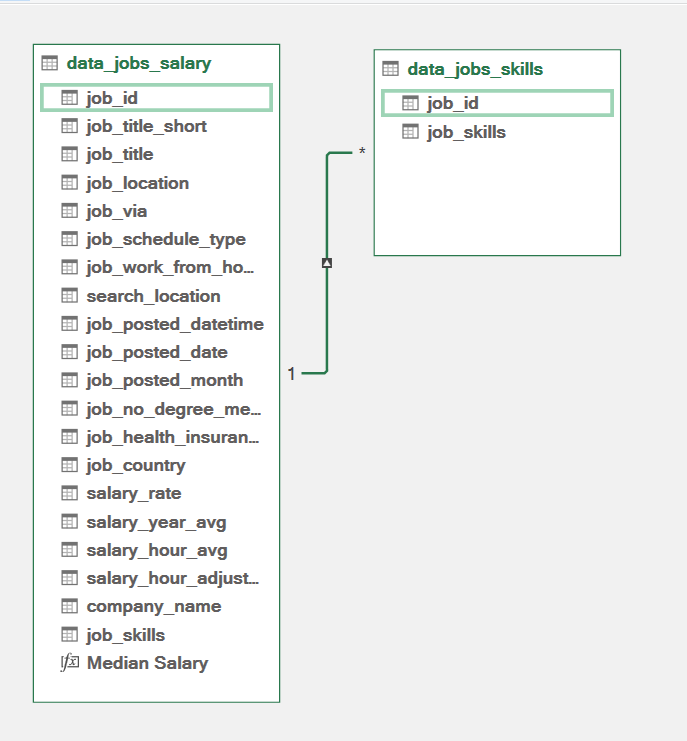
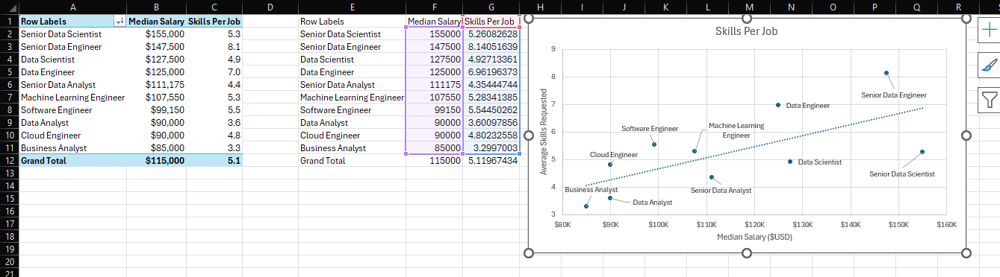
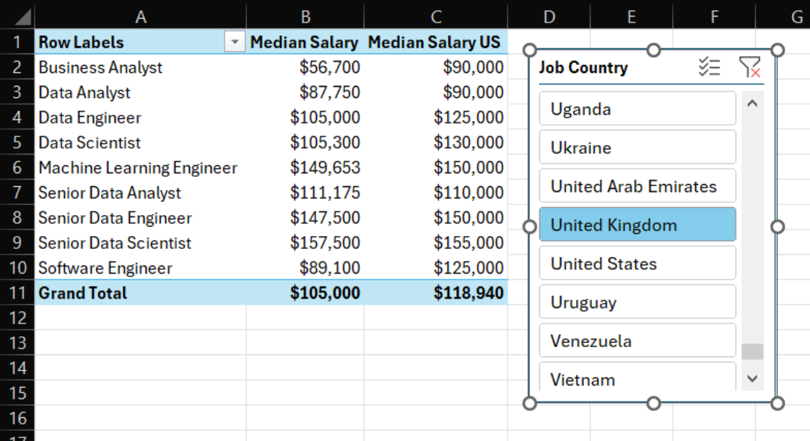
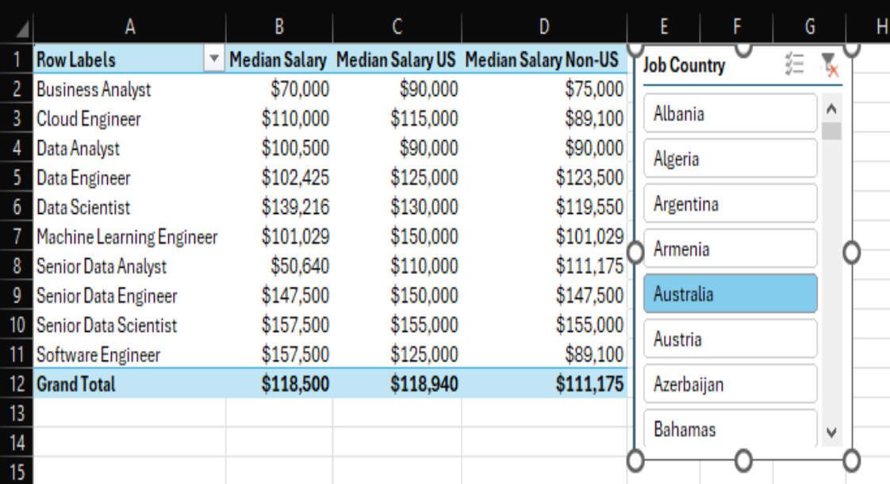
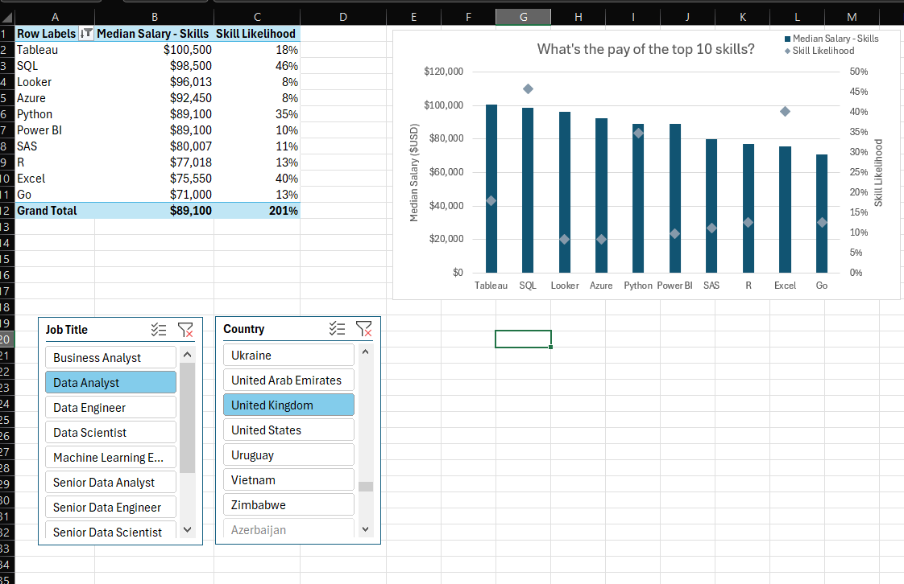

# 📈 Data Science Job Market Research

## 📊 Research Overview
This project is a technical study of the global Data Science job market using real-world data from 2023. The goal was to research how specific skills and locations affect salary. 

Instead of using simple tables, I built a **relational data engine** using **Power Query, Power Pivot, and DAX**. This allowed me to find deep patterns in the data that basic spreadsheets cannot show.

---

## 🎓 Learning Journey

This project was developed while mastering advanced Excel modeling techniques. You can explore the step-by-step development and specific lessons learned in the following modules:

* 📂 [**Power Pivot & DAX Modeling**](../8-PowerPivot-and-DAX) — *Core project foundation.*
* 📄 [**Advanced DAX Analysis**](../8-PowerPivot-and-DAX/4-Dax-Advanced) — *Specific logic used for this research.*

---
## ❓ The Core Questions
To provide actionable insights for data professionals, I focused on four pillars:
1. **Skill Premium:** Do more skills actually lead to better pay?
2. **Regional Disparity:** How does salary vary across different global regions?
3. **In-Demand Skills:** What are the foundational and emerging skills of data professionals?
4. **Top-Tier Pay:** What is the actual market value of the top 10 most requested skills?

### 🛠️ Excel Skills Utilized
* **🔍 Power Query:** Advanced ETL (Extract, Transform, Load) for data cleaning.
* **💪 Power Pivot:** Relational data modeling and Star Schema design.
* **🧮 DAX (Data Analysis Expressions):** Statistical measures for dynamic analysis.
* **📊 Pivot Tables & Charts:** Interactive visualization and dashboarding.

---

## 🏗️ Analytical Deep Dive

### 1️⃣ Aggregation: Turning Raw Data into Signals
I used **Power Query** to architect a robust data foundation, extracting raw information from `data_salary_all.xlsx`.

* **📥 Extract:** Created two specialized queries—one for general job information and another mapping specific skills to Job IDs.
* **🔄 Transform:** I cleaned the text to eliminate noise, removed unnecessary columns, and trimmed whitespace to ensure the Join keys were perfect.
* **🔗 Load:** Both queries were loaded into the **Power Pivot Data Model**.




---

### 2️⃣ Statistics: Skills vs. Pay
I focused on **Median Salary** rather than averages to provide a realistic benchmark, plotting *Skills per Job* against *Compensation*.

**The Insight:** A strong positive correlation exists between the number of skills requested and the median salary, particularly for **Senior Data Engineers** and **Data Scientists**. Roles like **Business Analysts** often require fewer skills but command a lower market value.



> **"So What?"** This trend emphasizes the high market value of specialization. Acquiring a dense, relevant skillset is the most direct path to higher-paying roles.

---

### 3️⃣ Context Filtering: Global Salary Benchmarking
Using **DAX**, I created comparative measures to benchmark international roles against the US market standard.

* **🧮 Custom DAX Measure:**
```dax
Median Salary (US) := CALCULATE(
    MEDIAN(data_jobs_all[salary_year_avg]),
    data_jobs_all[job_country] = "United States"
)
```

### 📊 The Discovery: Regional Salary Variance
High-tech roles show a significant pay disparity between the US and the rest of the world. However, localized analysis in the **UK** and **Australia** revealed that for specific niches, these markets can actually outperform US medians.

| **UK vs. US Benchmark** | **Global Comparison (Australia/US/Non-US)** |
| :---: | :---: |
|  |  |

---

### 4️⃣ Power Pivot: The Data Model
I bridged the gap between raw data and insights by creating a relationship between my tables using the `job_id` column. This architecture allows the Dashboard to react instantly to user slicers.


* **Top Skills:** SQL and Python dominate, reflecting their foundational role in the data ecosystem.
* **Cloud Shift:** Emerging technologies like **AWS** and **Azure** are now tied to the highest-paying salary brackets.

---

### 5️⃣ Overcoming Technical Challenges: Top 10 Skills & Likelihood
A major hurdle occurred when I tried to rank the **Top 10 Skills by Pay**. The default one-way relationships in Power Pivot blocked the skills table from filtering salary data correctly.

> **The Solution:** I implemented the `CROSSFILTER` function in DAX to enable bi-directional communication between the skills table and the salary data, ensuring accurate filtering.

**Likelihood Measure:** I developed a formula to calculate the probability of a specific skill leading to above-median pay:

$$Likelihood = \frac{Total\ Jobs\ with\ Skill\ paying\ >\ Median}{Total\ Jobs\ with\ Skill}$$



**Result:** High-value skills like **Python** and **Oracle** are not just popular; they are statistically significant indicators of high-salary potential.

---

### 🎓 Why This Matters
This project transformed my approach to data from basic spreadsheets to **Engineered Data Models**.

* **Dynamic Response:** The model responds instantly to slicers, providing a seamless user experience.
* **Logic-First:** The focus is on analytical architectural thinking rather than simple formula memorization.
* **Tool Proficiency:** Demonstrated that Excel, when powered by DAX, functions as a high-level Business Intelligence tool.
